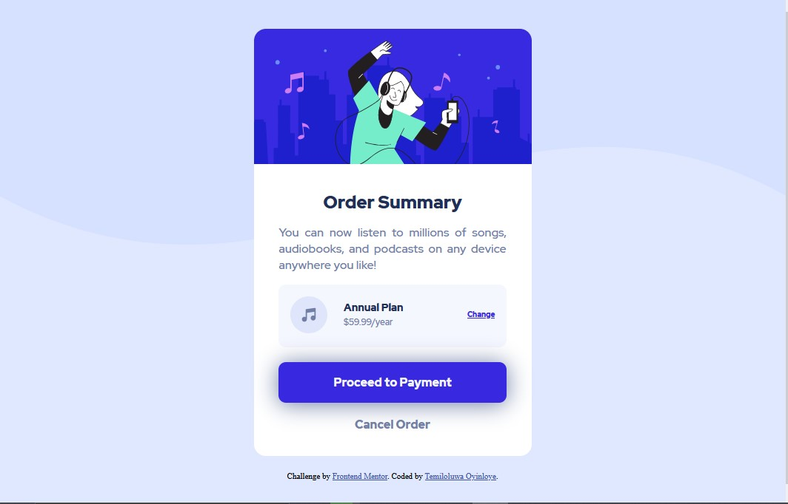

# Frontend Mentor - Order summary card solution

This is a solution to the [Order summary card challenge on Frontend Mentor](https://www.frontendmentor.io/challenges/order-summary-component-QlPmajDUj). Frontend Mentor challenges help you improve your coding skills by building realistic projects. 

### The challenge

Users should be able to:

- See hover states for interactive elements

### Screenshot

### Links

- Solution URL: [Solution URL here](https://github.com/adelolu/Order-summary)
- Live Site URL: [Live site URL here](https://adelolu.github.io/Order-summary/)

## My process

### Built with

- Semantic HTML5 markup
- CSS custom properties
- SCSS
- Flexbox
- CSS Grid
- Mobile-first workflow

### Useful resources

- [w3schools](https://www.w3schools.com/) 
- [Pluralsight](https://www.pluralsight.com/) 

## Author

- Frontend Mentor - [Temiloluwa Oyinloye](https://www.frontendmentor.io/profile/adelolu)

